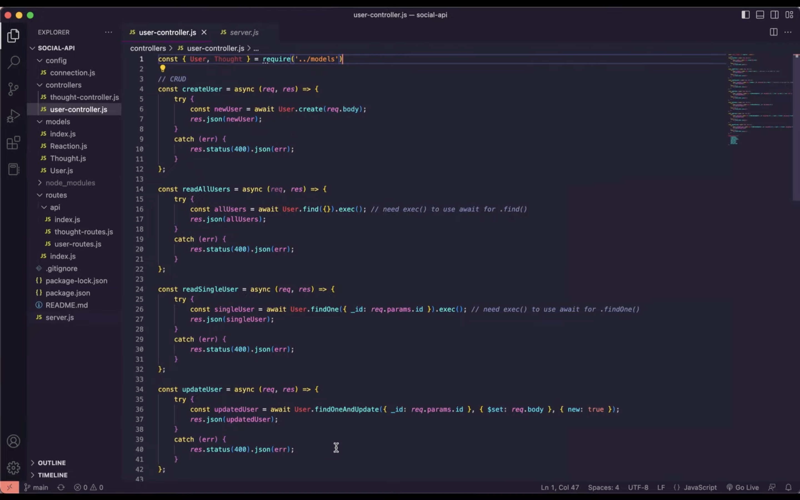
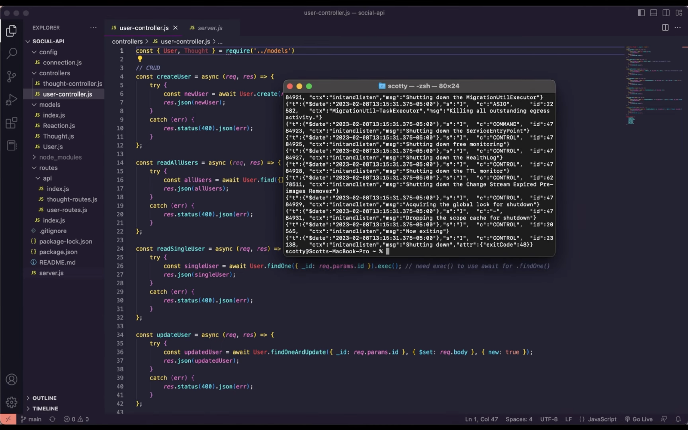
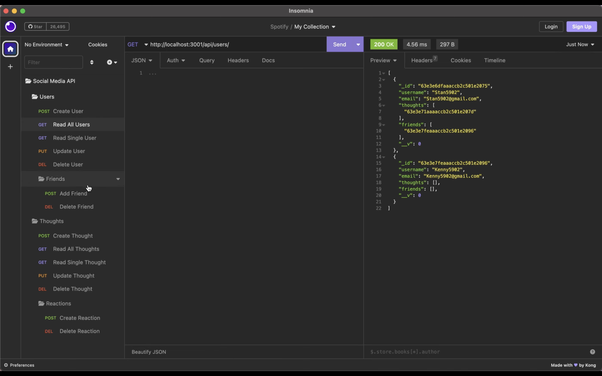

# social-api
A working social media api created using VSCode, MongoDB, Mongoose ODM, & Express.js with JSON data storage and retrieval demonstrated using Insomnia


## 💡 Table of Contents

- [Description](#description-id)
- [New Tech Learned](#newtech-id)
- [Installation](#installation-id)
- [Usage](#usage-id)
- [Screenshots](#screenshots-id)
- [Links](#links-id)

## <a id="description-id"></a>Description
This project was created to utilize *MongoDB* and *Mongoose ODM* to create, read, update, & delete (**manange**) a social media apps database using a 'Social Media API' created from scratch. Mongoose is a JavaScript object modeler that handles JavaScript code & MongoDB/NoSQL data inside of applications. *NoSQL* means the data is unorganized and unrelated. It is the polar opposite of a relational database that uses SQL. Using these back-end technologies that are geared toward handling a social media apps data, we can take in an infinite amount of random users (who have thoughts, friends, and reactions) that need to be tracked & stored but in no structured way. In this case, however, we will only be using a couple of users to demonstrate how they are created, accessed & changed. Using *Express.js* & *Insomnia*, the routing and navigation of such a database is visually demonstrated. Please refer to the video link directly below

> <strong>Full visual demonstration: https://youtu.be/_9QMaGcVVWM</strong>

## <a id="newtech-id"></a>New Tech Learned

```js
- MongoDB
- Mongoose ODM
- Unrelational database structuring 
- Routing MongoDB with Insomnia
```

## <a id="installation-id"></a>Installation
To use this application, you must download *Node.js* onto your local machine. Please visit https://nodejs.org/en/ to install 
</br></br>
<u>You will also need:</u>
- VSCode: (https://code.visualstudio.com/download) 
- Insomnia: (https://insomnia.rest)
- MongoDB: (https://www.mongodb.com)
- Mongoose ODM: (https://mongoosejs.com)
- The code: (https://github.com/ScottsC0de/social-api)

## <a id="usage-id"></a>Usage
With node installed, you can now run node commands on JavaScript files. To use this app, first, we must initialize the database by typing ```mongod``` in our terminal. Then, open VSCode or the CLI. To use proceed using the app, you must be in its file from the CLI or an app that allows you to run CLI commands. For this app we used VSCode’s Integrated Terminal. If you are using VSCode, right click on the server.js file and click ‘Open In Integrated Terminal’. Run a node server.js command to fire up our server. You should receive a console log message saying our server is listening. This means we can now access our Mongo database

Head over to Insomnia and follow the proper routing methods in this video to create, read, update, and delete the data used in our social network app

```js
Insomnia Methods

Create data using post()
Read data using get()
Update data using put()
Delete data using delete()

All specific routes available in code & in video demonstration
```
<br>

## <a id="screenshots-id"></a>Screenshots

<br>


<br>


<br>


<br>

## <a id="links-id"></a>Links
The author is a developer with a GitHub account: https://github.com/ScottsC0de & email: **Scott5902@gmail.com**</br>
> YouTube video demonstration: https://youtu.be/_9QMaGcVVWM</br>
> GitHub project repo: https://github.com/ScottsC0de/social-api